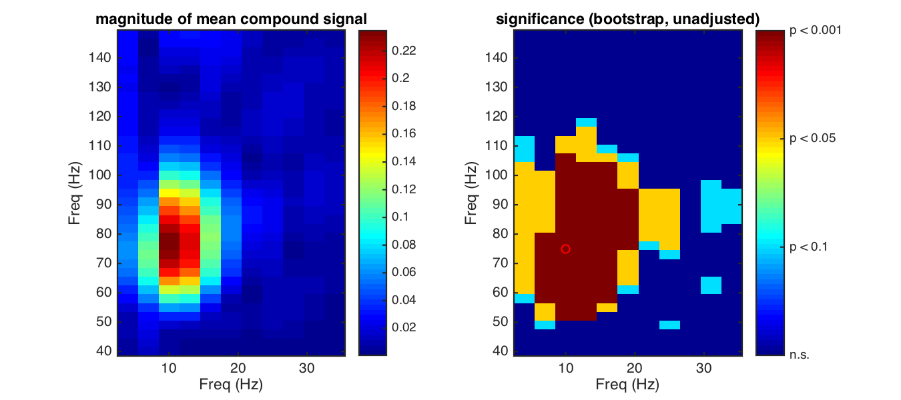

# Cross-frequency coupling estimators

## Example signal

## Example result

## References
- Canolty, R. T., Edwards, E., Dalal, S. S., Soltani, M., Nagarajan, S. S., Kirsch, H. E., Berger, M. S., Barbaro, N. M., and Knight, R. T. (2006). High gamma power is Phase-Locked to theta oscillations in human neocortex. _Science_, 313(5793):1626-1628.
- Penny, W. D., Duzel, E., Miller, K. J., and Ojemann, J. G. (2008). Testing for nested oscillation. _Journal of Neuroscience Methods_, 174(1):50-61.
- Tort, A. B. L., Komorowski, R., Eichenbaum, H., and Kopell, N. (2010). Measuring Phase-Amplitude coupling between neuronal oscillations of different frequencies. _Journal of Neurophysiology_, 104(2):1195-1210.
- Tort, A. B. L., Kramer, M. A., Thorn, C., Gibson, D. J., Kubota, Y., Graybiel, A. M., and Kopell, N. J. (2008). Dynamic cross-frequency couplings of local field potential oscillations in rat striatum and hippocampus during performance of a t-maze task. _Proceedings of the National Academy of Sciences_, 105(51):20517-20522.
- Bruns, A. and Eckhorn, R. (2004). Task-related coupling from high- to low-frequency signals among visual cortical areas in human subdural recordings. _International Journal of Psychophysiology_, 51(2):97-116.
- Lachaux, J.-P., Rodriguez, E., Martinerie, J., and Varela, F. J. (1999). Measuring phase synchrony in brain signals. _Human Brain Mapping_, 8(4):194-208.
